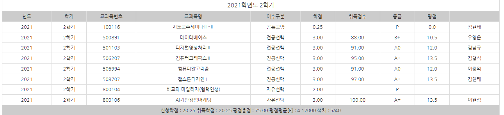

# School_3.2

### 참으로 바빴던 저의 3학년 2학기의 학습내용이 담긴 레포입니다.  
### 해당 학기가 종료될 시 공개로 전환됩니다.    

 

신청학점 : 20.25    취득학점 : 20.25    
평점총점 : 75.00    평점평균 : 4.17000    석차 : 5/40

 
궁금한 사항 있다면 연락 주세요~!  
 - 📞 연락 : https://open.kakao.com/o/sTZ83nR
 
  

---
  

### 대내외활동
 - 참여한 대내외 활동입니다.
 - 경주-창업캠프, 라이브커머스경진대회, 초개인화시대를위한초니치마케팅캠프, 콜라보학습캠프, 통합성과경진대회, 튜터링
 
| 기간 | 활동내역 | 비고 |
| :---: | ------ | :--: |
| 11.18 ~ 11.26 | 부산권 6개 대학 LINC+ 공유대학 초니치개인화마케팅 캠프 (최우수상) ||
| 11.04 ~ 11.26 | 부산권 연합 2021 라이브커머스 경진대회 | [수상결과](./image/2021_라이브커머스_수상결과.png) |
| 11.05 ~ 11.06 | 희망 play 취업 Job Go 캠프 포트폴리오 경진대회 (대상) ||
| 11.04 ~ 11.26 | 동의대학교 2021 통합성과경진대회 (장려상) ||
| 10.01 ~ 10.02 | 4C 블렌디드 융합 프로그램 MIX (우수상) |  |
| 09.20 ~ 11.23 | 전공학습 튜터링 (우수팀) | |

 * 3연속 우수팀 선정된 튜터의, 튜터링 우수팀 선정 전략?
  > 문서를 예쁘게쓰자! (알록달록, 형광펜 칠, 사진활용, 꽉꽉채우기)

  

---
  

### 🎀 AI기반창업마케팅 - 이현섭
 > 대회만 참여하면 되는데 그 대회에서 선배릠들과 재미난 추억 많이 쌓았슴니다! 너무 즐거웠던 수업!
 - 절대평가 과목입니다.
 - 여러가지 창업관련 대회 혹은 활동에 참여하고 활동 내역을 제출하기만 했습니다.
 
🔑 수업 키워드 : 창업, 대회 참가, 꿀과목

  
### 🦄 데이터베이스 - 우영운
 > 수업 시간에 하던 퀴즈 풀이가 너무 재미있었어요!   heidiSQL로 실습하며 여러 쿼리 짜보며 이해하는 것도 재미났습니다!   유익한 수업이니 이 수업만큼은 드랍하지 마시길!
 - 팁 : 쿼리문을 많이 써보는 연습하기, 시험지 다시 한 번 풀어보기 - 물론 저는 안 해서 틀립니다.
 - 연습문제 모음집 : 수업시간에 했던 연습 문제들을 모았습니다.
 - 예상문제 만들기 : 저 혼자 문제를 만들고 놀아보았습니다.
 - 수업요약 : 중간/기말을 나누어 요약했습니다.
 
🔑 수업 키워드 : MySQL, heidiSQL, 쿼리, DB의 구조, 무결성

  
### 🎈 디지털영상처리II - 김남규
 > 영상처리1 만큼은 재미나진 않았지만, 이전보다 이해하기 쉬운 개념이 많아 따라가기 쉬웠어요!   마지막 개인 프로젝트까지 재미났어요!
 - 팁 : 식을 못 쓰겠다면 식의 의미라도 이해하기.
 - 강의자료 : 교수님이 제공하는 시험문제보다 더 이전의 시험문제 파일 또한 포함되어 있습니다.
 - 프로젝트 : 영상처리2의 프로젝트 제안서/코드/결과보고서가 포함되어 있습니다.
 - 예상문제 : 혼자 공부하며 나오지 않을까? 싶은 문제를 만들어 풀었습니다.
 - 수업요약 : 중간/기말을 나누어 요약했습니다.  

🔑 수업 키워드 : 에지검출, 특징 검출, 개체 추출, 머신러닝, 신경망

  
### 🛒 캡스톤디자인 - 김현태
 > 진짜 모르겠어요!
 - 팁 : 모르겠습니다.
 - 프로젝트 영상 : https://www.youtube.com/watch?v=st9xLwYK5Bc

🔑 수업 키워드 : 자유로움, 창업

  
### 🎨 컴퓨터그래픽스II - 김형석
 > 김형석 교수님 특유의 수업방식으로 재미났습니다! 1만한 2는 잘 없나봅니다..ㅠㅠ   텍스쳐 부분에서 공부가 좀 필요해서 많은 재미를 느꼈던 수업입니다!   동기/비동기를 잘 활용할 수 있었다면 더 나은 결과가 나왔을 텐데... 프로젝트에서 아쉬움이 느껴집니다!
 - 팁 : 답안을 길게 적는걸 좋아하십니다. 프로젝트는 아이디어를 생각보다 많이 보십니다.
 - 수업요약 : 중간/기말을 나누어 요약했습니다.
 - 프로젝트 영상 : https://www.youtube.com/watch?v=gmpMjZ86BK8
 
🔑 수업 키워드 : 3D 객체, 충돌처리, 질감표현, 유니티 맛보기

  
### 🪁 컴퓨터알고리즘 - 이광의
 > 알고리즘을 좋아해서 기존에 알고있던 자료구조와 알고리즘이 많은 도움이 되었습니다!   코로나탓에 많이 뵙지 못한것이 아쉽습니다...ㅠㅠ
 - 팁 : 손으로 단계별로 그림을 그려가며 풀어보면 도움이 됩니다!
 - 기존에 아는 내용이 꽤 있어 요약이 잘 되어있지 않습니다. "게임자료구조요약.hwp" 파일이 유사한 내용을 담고 있어 첨부했습니다. 

🔑 수업 키워드 : 트리, 그래프, 탐색, 백트래킹

  
